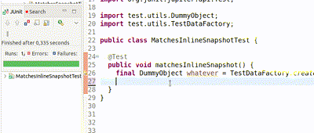

# AssertJ Snapshot
[](https://central.sonatype.com/artifact/se.bjurr.assertj.snapshot/assertj-snapshot)

This library extends [AssertJ](https://github.com/assertj/assertj) with snapshot assertions. Inspired by the same feature in [Jest](https://jestjs.io/docs/snapshot-testing).



## Examples

There are running examples in the [repository](/src/test/java/test/examples).

Assertions are made available by importing:

```java
import static org.assertj.snapshot.api.Assertions.assertThat;
```

A snapshot can be recorded to a file, like this:

```java
assertThat(anyObject)
 .matchesSnapshot();
```

First time this code is run, a snapshot file will be created. Any future runs will verify against that snapshot.

A `snapshot` can also be recorded inline, in the test case:

```java
assertThat(anyObject)
 .matchesInlineSnapshot();
```

When this is run, it will manipulate the test case and change it like this:

```java
assertThat(anyObject)
 .matchesInlineSnapshot("""
  {
   "someAttr1" : "abc",
   "someAttr2" : 123
  }
 """);
```

Any future runs will verify against that snapshot.
